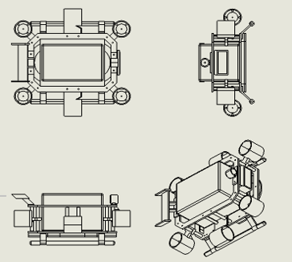
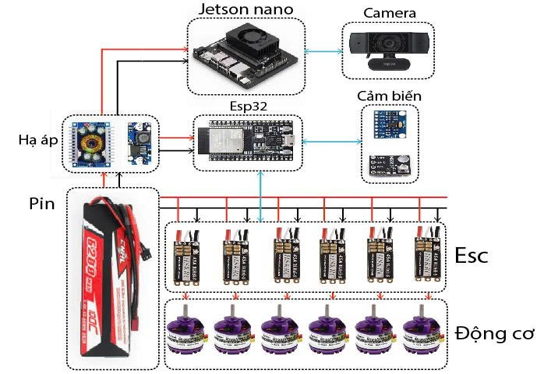
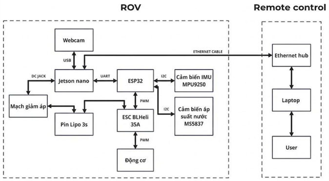

ROV_Tracking-v1: Autonomous Underwater Vehicle
Hệ thống tàu lặn tự hành (ROV) tích hợp thị giác máy tính để nhận diện và bám mục tiêu thời gian thực, sử dụng kiến trúc xử lý phân tán Jetson Nano và ESP32. Autonomous Underwater Vehicle (AUV) system integrated with Computer Vision for real-time object detection and tracking, utilizing a distributed architecture between Nvidia Jetson Nano and ESP32.

1. Kiến trúc hệ thống | System Architecture
Dự án sử dụng mô hình Master-Slave để tối ưu hóa việc xử lý đồng thời: The project employs a Master-Slave model to optimize concurrent processing:

_High-level Control (Nvidia Jetson Nano - Master):

  Thực thi xử lý ảnh với TensorRT và YOLOv8 (input 416x416).
  Executes image processing using TensorRT and YOLOv8 (416x416 input).  
  Quản lý giao diện điều khiển (GUI) bằng Tkinter.  
  Manages the Graphical User Interface (GUI) via Tkinter.  
  Tính toán logic tracking và gửi lệnh điều khiển (Surge, Yaw, Depth) qua UART.  
  Calculates tracking logic and transmits control commands (Surge, Yaw, Depth) via UART.

_Low-level Control (ESP32 - Slave):

  Lập trình bằng ngôn ngữ C (FreeRTOS) để đảm bảo tính thời gian thực.  
  Programmed in C (FreeRTOS) to ensure real-time performance. 
  Xử lý vòng lặp PID (Depth, Heading Hold) và xuất tín hiệu PWM (50Hz) điều khiển 06 động cơ. 
  Processes PID control loops (Depth, Heading Hold) and generates 50Hz PWM signals for 06 thrusters.  
  Giao tiếp cảm biến qua bus I2C (100kHz).  
  Handles sensor communication via 100kHz I2C bus.

2. Thông số kỹ thuật | Hardware Specifications
_Cấu hình động cơ | Thruster Configuration (06 Thrusters):

  04 động cơ đứng (Vertical): Điều khiển cao độ và ổn định cân bằng.  
  04 Vertical thrusters: Depth and attitude stabilization control.  
  02 động cơ ngang (Horizontal): Điều khiển tiến/lùi (Surge) và xoay hướng (Yaw).  
  02 Horizontal thrusters: Surge and Yaw control.

_Hệ thống cảm biến | Sensor Suite:

  MS5837: Cảm biến áp suất độ phân giải cao dùng cho Depth Hold (giữ độ sâu).  
  MS5837: High-resolution pressure sensor for Depth Hold functionality.  
  MPU9250: IMU 9 trục cung cấp dữ liệu góc quay phục vụ thuật toán Heading Hold.  
  MPU9250: 9-axis IMU providing orientation data for Heading Hold algorithms.  
  Truyền thông | Communication: UART (57600 baud).

3. Chế độ vận hành | Operating Modes
3.1. Manual Mode (Thủ công)
  Điều khiển trực tiếp Surge và Yaw qua phím bấm (W/A/S/D).  
  Direct control of Surge and Yaw via keyboard inputs (W/A/S/D).  
  Heading Hold: Tự động duy trì hướng quay cuối cùng khi ngừng điều khiển bằng bộ lọc Gyro và PID.  
  Heading Hold: Automatically maintains the last orientation using Gyro filtering and PID control.

3.2. Auto Mode (AI Tracking)

  Nhận diện | Detection: Model YOLOv8 tối ưu cho vật thể dưới nước (chai xanh/cam).  
  Detection: YOLOv8 model optimized for underwater objects (blue/orange bottles).  
  Logic bám mục tiêu | Tracking Logic:  
  Yaw: Tính toán sai lệch tâm (Offset X) để xoay thân ROV bám theo vật thể.  
  Yaw: Calculates horizontal offset (Offset X) to align the ROV with the target.  
  Surge: Duy trì khoảng cách dựa trên diện tích vật thể (Target Area: 11000).  
  Surge: Maintains distance based on object area (Target Area: 11000).  
  Depth: Tự động điều chỉnh độ sâu mục tiêu dựa trên Offset Y.  
  Depth: Automated depth adjustment based on vertical Offset Y.  
  Smart Integral: ESP32 tự động giảm thông số tích phân khi mục tiêu thay đổi nhanh (>3cm) để chống vọt lố.  
  Smart Integral: ESP32 automatically mitigates integral windup when the target shifts rapidly (>3cm) to prevent overshoot.

4. Công nghệ sử dụng | Tech Stack
   
  Firmware: C (ESP-IDF/FreeRTOS).  
  Software: Python (Tkinter GUI, PySerial).  
  AI Framework: NVIDIA TensorRT, Ultralytics YOLOv8.  
  Sensors Library: MS5837, MPU9250 (I2C).

## 📐 Mechanical Design
Toàn bộ kết cấu cơ khí của ROV được thiết kế trên SolidWorks.
*The entire mechanical structure of the ROV is designed in SolidWorks.*

* **Source Files:** `/mechanical_design`
* **Main Assembly:** Mở file `Khung hoàn chỉnh.SLDASM` để xem toàn bộ hệ thống.
* **Universal Format:** File `Khung hoàn chỉnh.STEP` (AP214) dành cho các phần mềm CAD khác.

### 🎬 Project Video Playlist
Để xem toàn bộ quá trình thử nghiệm và vận hành của dự án, vui lòng truy cập playlist dưới đây:

(https://youtube.com/playlist?list=PL-FaXe2c4DjPuzOlRJh49i_SyJp_6md01)

